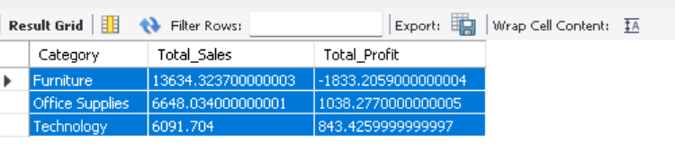
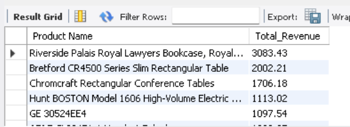
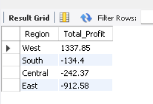
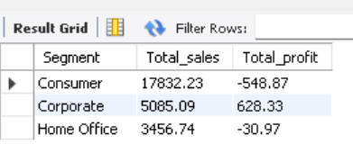
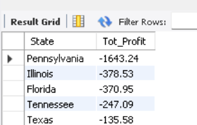
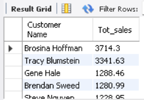
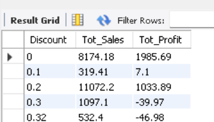

# Retail Sales Analysis using SQL

## Project Overview
This project analyzes retail sales data using the Sample Superstore dataset and SQL to uncover trends and generate business insights.

## Dataset
- Sample Superstore Dataset

## Tools Used
- SQL
- MySQL Workbench

## Analyses Performed
- Total sales and profit by category
- Top 10 products by revenue
- Most profitable region
- Customer segment performance

## Key Insights
- Identified high-performing products.
- Compared profitability across regions.
- Analyzed category-wise sales and profits.

## Files
- superstoresql.sql

##Authur
Gopika J

## 📸 Screenshots

### 1. Sales by Category

---

### 2. Top Products by Revenue

---

### 3. Most Profitable Region

---

### 4. Customer Segment Performance

---

### 5. States with Losses

---

### 6. Top Customers by Sales

---

### 7. Discount Impact on Profit

## Author
Gopika J
